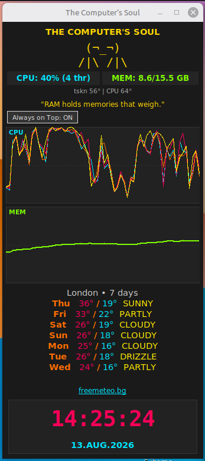

# The Computer's Soul

[](https://www.python.org/)
[](https://docs.python.org/3/library/tkinter.html)
[](#requirements)
[](#how-to-run)
[](#requirements)
[](#requirements)
[](#tips)
[](#how-to-run)
[](#how-to-run)
[](#the-computers-soul)
[](#the-computers-soul)
[](#the-computers-soul)
[](#the-computers-soul)
[](#the-computers-soul)
[](https://open-meteo.com/)
[](#the-computers-soul)
[](https://open-meteo.com/)
[](#how-to-change-the-city--weather-location)
[](#tips)
[](#the-computers-soul)
[](#tips)
[](#the-computers-soul)
[](#the-computers-soul)
[](#the-computers-soul)
[](#the-computers-soul)
[](#the-computers-soul)
[](#requirements)
[](#license)
[](#license)
[](#license)
[](#license)

A lightweight, always-on-top system monitor with personality.

Please see the picture:



It shows:

- Live **CPU** usage (per-thread graphs)
- **Memory** usage graph
- Hardware **temperatures** (where available)
- Disk usage + live read/write speed
- System **uptime**
- A **7-day weather** forecast
- A big **clock + date** (click for calendar)
- Short **poems** that change according to system load (“the soul”)

Built-in cities: **Сандански**, **София**, **Лондон**.  
Weather comes from the free [Open-Meteo](https://open-meteo.com/) API.

---

## Requirements

- Python **3.6+**
- **tkinter** (usually included with Python on Linux)
- **Linux** (uses `/proc` and `/sys` for CPU, memory, temperatures, disks, uptime)

Works best on Linux. On other systems the CPU / memory / temp parts may not work or will show limited data.

No `pip install`. Standard library only. Internet is needed only for the weather panel.

---

## How to run

1. Put the file `soul_gui.py` into your **HOME** folder.
2. Right-click the file → **Options → Permissions** and check all **Execution** boxes.
3. Move `Душата.desktop` onto the **Desktop** and do the same:  
   Right-click → **Options → Permissions** → check all **Execution** boxes.

That's it — now you can use the program.

From a terminal:

```bash
python3 "$HOME/soul_gui.py"
```

---

## How to change the city / weather location

The window already has a city menu (Сандански / София / Лондон).  
To add another city, edit `soul_gui.py` — the `self.cities` dictionary near the top of `SoulMonitor.__init__`.

If you are too lazy to do the changes yourself, ask for free help: **good.vibes.github@gmail.com**

You need three things per city:

1. Coordinates + timezone  
2. Display name  
3. freemeteo hourly-forecast URL

### 1. Coordinates + timezone

| City | Latitude | Longitude | Timezone |
| --- | --- | --- | --- |
| London, UK | 51.5074 | -0.1278 | Europe/London |
| New York, USA | 40.7128 | -74.0060 | America/New_York |
| Tokyo, Japan | 35.6762 | 139.6503 | Asia/Tokyo |
| Sofia, Bulgaria | 42.6977 | 23.3219 | Europe/Sofia |
| Sandanski, BG | 41.5667 | 23.2833 | Europe/Sofia |

Accurate coordinates: Google Maps or [Open-Meteo](https://open-meteo.com/).

Example entry:

```python
"Ню Йорк": {
    "lat": 40.7128, "lon": -74.0060, "tz": "America/New_York",
    "fm": "https://freemeteo.bg/weather/new-york/hourly-forecast/today/?gid=5128581&language=bulgarian&country=united-states"
}
```

Then set the starting city:

```python
self.current_city = "Ню Йорк"
```

### 2. How to change the freemeteo hyperlink

At the bottom of the weather panel there is a clickable **freemeteo.bg** link.

1. Go to [https://freemeteo.bg](https://freemeteo.bg)
2. Search for your city
3. Open the **Hourly forecast** page for today
4. Copy the full URL
5. Put it in the `"fm"` field of that city

London example:

```text
https://freemeteo.co.uk/weather/london/hourly-forecast/today/?gid=2643743&language=english&country=united-kingdom
```

### 3. Day names (optional)

Forecast days are already in Bulgarian:

```python
bg_days = ["Пон", "Втор", "Сря", "Четв", "Пет", "Съб", "Нед"]
```

---

## The soul

Mood follows CPU + RAM load (and a “night” state when both are very low):

| State | When | Color |
| --- | --- | --- |
| night | CPU and RAM under 25% | cyan |
| calm | load under 35% | green |
| medium | load under 65% | gold |
| high | load under 85% | orange |
| critical | load 85%+ | red |

A short Bulgarian line is picked at random for the current mood.

---

## Tips

- Weather refreshes every **30 minutes** (`self.weather_interval = 1800`).
- The window stays **always-on-top** by default. Use the button to toggle it.
- Click the **clock / date** to open a 3-month calendar.
- Hardware temperatures come from `/sys/class/thermal/` — if the kernel does not export them, you will see `Темп: няма данни`.

---

## License

**Forever Free** for use by everyone: private and/or public and/or business.

You are free to use it as it is or change anything you want depending on your whims.

Any issues, questions, etc.:

**good.vibes.github@gmail.com**

Enjoy watching your computer's soul.
